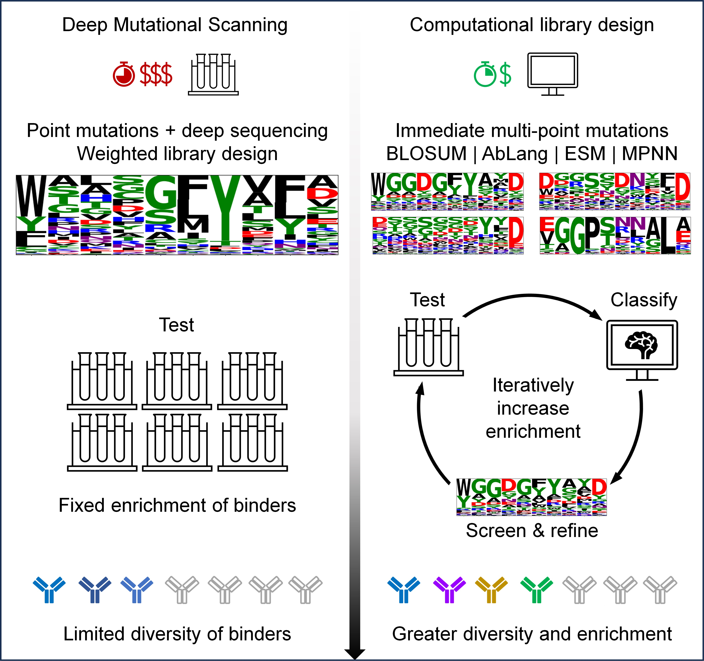

<h1 style="text-align: center;">Baselining the Buzz.

*Trastuzumab-HER2 Affinity, and Beyond!*</h1>

<a href="url"></a>

Code to accompany the paper titled: "Baselining the Buzz. Trastuzumab-HER2 Affinity, and Beyond!"

Code developed by Lewis Chinery and Alissa Hummer. CNN code adapted from [Mason et al](https://github.com/dahjan/DMS_opt).


## Abstract

Machine learning shows great promise for accelerating therapeutic antibody design and optimisation. The field, however, lacks robust baselines quantifying expected binder enrichments and computational strategies that can be seamlessly integrated with experimental workflows.

In this study, we use a dataset of over 524,000 Trastuzumab variants to show that standard computational methods such as BLOSUM, AbLang, ESM, and ProteinMPNN can be used to design highly diverse, binder-enriched antibody libraries from just a single starting sequence. We experimentally validate 700 of these designs using Biolayer Interferometry. We also demonstrate that, even with only a very small number of experimental data points, simple machine learning classifiers can be trained in seconds to accurately pre-screen future designs. This pre-screening maintains library diversity and saves experimental time and money.



## Install

Follow the steps below to download the code and the necessary packages. Requires **Python 3.9**.

Note - approximately 10GB is required to install all dependecies and download ESM and AbLang weights.

```
# clone the repo
git clone https://github.com/oxpig/Tz_her2_affinity_and_beyond.git
cd Tz_her2_affinity_and_beyond/

# create your virtual env e.g.
python3 -m venv .buzz_venv
source .buzz_venv/bin/activate

# install
pip install .
```

If you are having issues installing, try upgrading pip: *pip install --upgrade pip*.


## Usage

Source code is provided in the `src` folder and example use cases are provided in `notebooks`. Examples include how to:
- Design antibody libraries against a given target from a single known binder using BLOSUM, AbLang, ESM, and ProteinMPNN.
- Train an ML classifier (FLAML, CNN, and EGNN) on affinity-labelled sequences to pre-screen future designs.


## Citation

```
@article{tbc}
```
